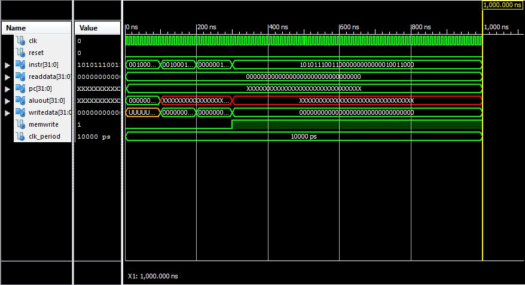

ECE281_CE5
==========
#Part 1 MIPS Program

addi $s0 $0 44

addi $s1 $0 -37

add $s2 $s0 $s1 0 32

sw $s3 0x54($0)

#Part 2 MIPS Program

My program did not initially work as we can see by the image above. I had incorrect hex numbers which translated into an
incorrect simulation. This error was correct in Part 3 in the debugging process. The error I had was that I confused the order between how the number would be written in assembly code, and how it would be written in machine code hexadecimally. 

#Part3 MIPS Program

The above simulation includes the added command of ori which logically or's two immediate values. 
